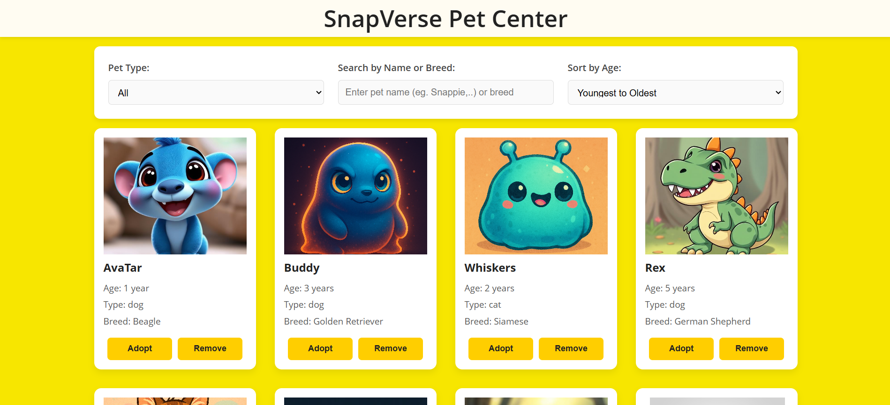

# 🐾 SnapVerse Pet Center

Welcome to **SnapVerse Pet Center**, a catalog website dedicated to helping users explore and adopt adorable pets from the SnapVerse! This project was created as part of the **Snapchat Academy** submission and showcases a fully interactive and visually engaging catalog of pets available for adoption.
[Deployed site](https://sukogurung.github.io/snap-engineering-stage2-project/)

## 📌 Project Description

This project features a dynamic website that displays a collection of pets using an **array of objects** as the primary data structure. Users can interact with the catalog through filtering, searching, and sorting functionalities. The website is clean, user-friendly, and easy to navigate.



## ✅ Features

- Displays a **rich collection of pet data** in a user-friendly catalog format.
- Built-in functionality to:
  - 🔍 **Search** pets by name or traits.
  - 🎯 **Filter** pets by type or breed.
  - ↕️ **Sort** pets by age and name. 
  - ❌ **Remove** pets from the catalog.


## 💻 Technologies Used

- 📁 **Data Structure** - **array of objects** to store pet information, for example:
```javascript
pets = [{
  name: "Luna",
  type: "Cat",
  breed: "Maine Coon",
  age: 2,
  adopted: false,
  image: "images/luna.jpg"
},...]
```
- 🧠 **Vanilla JavaScript** — Handles data logic, interactivity, and DOM manipulation.
- 🎨 **HTML & CSS** — Structure and styling for a clean, polished design.
- 🔧 **Google Developer Tools** & **Visual Studio Code** — For debugging, testing, and development.
- 📦 **Starter Code Base** — Customized and extended to create the final application.

---
